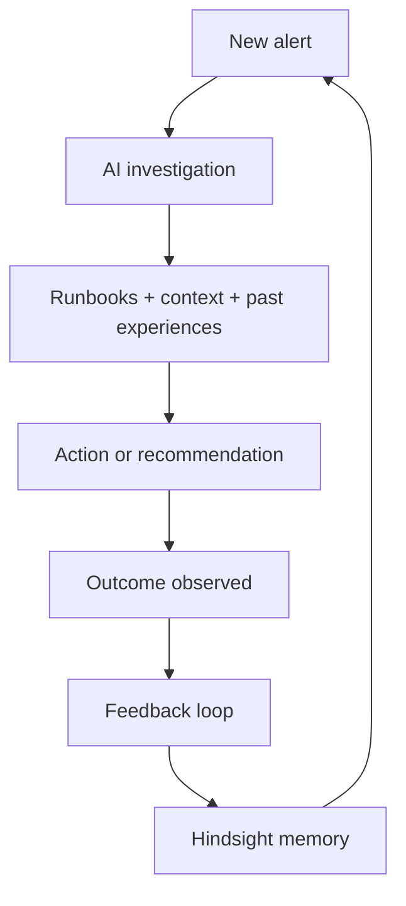
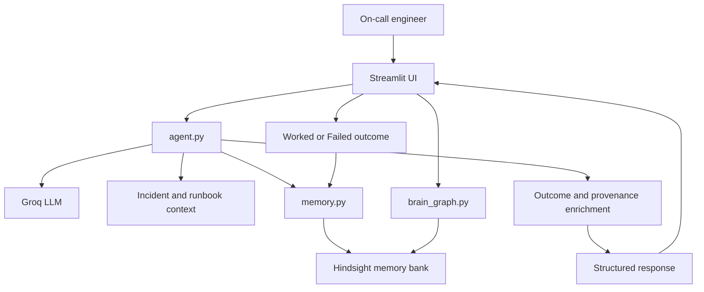
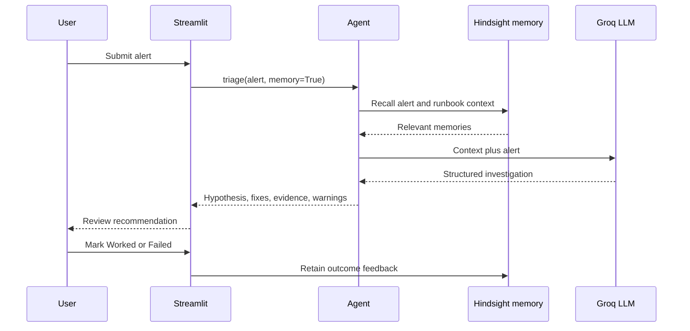

# DejaOps

**An open-source AI Incident Response Assistant that turns operational experience into reusable memory.**

DejaOps helps on-call engineers investigate alerts with persistent Hindsight memory, incident history, runbooks, action outcomes, and an explicit feedback loop.

## Why this exists

Incident response is often repetitive. Useful context is distributed across incidents, runbooks, and postmortems, while failed remediations can be easy to repeat. DejaOps compares a generic response with a response grounded in recalled operational history.

## The idea

Traditional assistant: `Alert -> AI -> Answer`

DejaOps: `Alert -> Investigate -> Recall -> Recommend -> Observe outcome -> Remember -> Recall on future incidents`



## Architecture





## Key features

- AI-assisted incident investigation through Groq.
- Persistent incident, runbook, postmortem, and feedback memory with Hindsight.
- Generic and memory-assisted responses shown side by side.
- Worked/Failed outcome recording for memory-assisted fixes.
- Historical evidence, warnings, rejected remediations, and action provenance.
- Deprecated runbook context and replacement relationships.
- Interactive Memory Graph with clusters, statuses, nearest relationships, and latest-recall highlighting.
- Synthetic Northwind Payments operational dataset and demo alerts.
- Streamlit interface with a small, inspectable Python codebase.

## Current project metrics

These are repository and dataset counts, not production performance claims.

| Metric | Current value |
|---|---:|
| Incidents | 120 |
| Runbooks | 20 |
| Demo alerts | 10 |
| Action records | 304 |
| Worked actions | 172 |
| Failed actions | 132 |
| Deprecated runbooks | 2 |
| Worked-action rate | 56.58% |
| Failed-action rate | 43.42% |
| Python source files | 8 |
| Python source lines | 1,283 |
| Test files | 2 |
| Test functions | 15 |

## How it works

1. Choose a demo alert or paste an alert containing a service, symptom, and error detail.
2. DejaOps validates the input and runs a generic baseline alongside memory-assisted triage.
3. Hindsight recalls related history and asks which runbooks apply or are deprecated.
4. The agent receives recalled memory, generates structured JSON, and the application normalizes it.
5. The UI presents hypotheses, vetted fixes, evidence, warnings, confidence, and memory influence.
6. Mark a memory-assisted fix **Worked** or **Failed** to retain engineer feedback.
7. Open the Memory Graph to explore stored memories and evidence connected to the latest triage.

## Example workflow

1. A payments alert arrives with elevated errors and database symptoms.
2. DejaOps recalls related incidents and applicable runbook context.
3. The agent presents a hypothesis, historical evidence, and recommended fixes.
4. An engineer reviews the recommendation and records whether the fix worked.
5. The outcome is retained as operational memory and can be recalled during a later related alert.

The system improves future context through retained experience; it does not update model weights.

## Dataset

The fictional Northwind Payments environment contains recurring patterns across Kubernetes, Postgres/PgBouncer, Redis, ingress-nginx, CoreDNS, Kafka, payments-api, checkout-service, auth-service, ledger-service, orders-api, notification-service, and the PayFlow gateway where present in the source data. All records are synthetic and live under `data/`.

## Quick start

```powershell
git clone <repository-url>
cd DejaOps
python -m venv .venv
.venv\Scripts\activate
pip install -r requirements.txt
copy .env.example .env
python validate_data.py
python seed.py
python check_setup.py
streamlit run app.py
```

For macOS/Linux, use `source .venv/bin/activate` and `cp .env.example .env`.

Set `HINDSIGHT_URL`, `HINDSIGHT_API_KEY`, and `GROQ_API_KEY` in `.env`. `DEJAOPS_BANK` optionally selects the Hindsight bank. Never commit secrets. Seeding is resumable through a bank-specific progress file under `data/`.

## Repository structure

```text
app.py              Streamlit triage UI and feedback controls
agent.py            Alert guard, prompts, Groq call, normalization, provenance
memory.py           Hindsight bank, retain, recall, and reflect wrapper
brain_graph.py      Memory listing, lexical clustering, and D3 visualization
seed.py             Resumable JSON-to-Hindsight loader
validate_data.py    Dataset schema and relationship checks
check_setup.py      Hindsight and Groq connectivity checks
merge_batches.py    Incident batch merge utility
data/               Synthetic incidents, runbooks, alerts, and batches
tests/              Focused pytest coverage for memory and agent behavior
docs/               Architecture, workflow, extension, and presentation docs
```

## Documentation

Start with [the documentation index](docs/DOCUMENTATION_INDEX.md), [the project overview](docs/PROJECT_OVERVIEW.md), and [the LLM context guide](docs/LLM_CONTEXT.md).

Important references include [system architecture](docs/SYSTEM_ARCHITECTURE.md), [memory architecture](docs/MEMORY_ARCHITECTURE.md), [the feedback loop](docs/FEEDBACK_LOOP.md), [data model](docs/DATA_MODEL.md), [testing](docs/TESTING.md), and [extending the project](docs/EXTENDING_THE_PROJECT.md).

## Built to be adapted

Clone the repository, configure model and memory credentials, run the Streamlit app, replace the demo data, add domain-specific tools, define outcome signals, and let the feedback loop create reusable operational memory. The current implementation provides these boundaries; each new integration should add its own authorization, audit, and data-handling policy.

The current implementation focuses on on-call incident response. The same memory and feedback architecture can later support SRE, SOC, IT operations, support operations, and infrastructure troubleshooting workflows.

## Technology

- Python
- Streamlit
- Groq
- Hindsight via `hindsight-client`
- JSON datasets
- pytest

## Contributing and extending

Start with [EXTENDING_THE_PROJECT.md](docs/EXTENDING_THE_PROJECT.md) and [LLM_CONTEXT.md](docs/LLM_CONTEXT.md). Keep data schemas and normalized agent response keys compatible, validate dataset changes, add focused tests for new memory or provenance behavior, and document new integrations with their configuration and security boundaries.

## HackWithHyderabad

DejaOps was developed for the HackWithHyderabad Hackathon, with the submission focused on persistent memory, agentic incident response, and feedback-driven improvement. The project identity is the reusable open-source incident response foundation described above.
