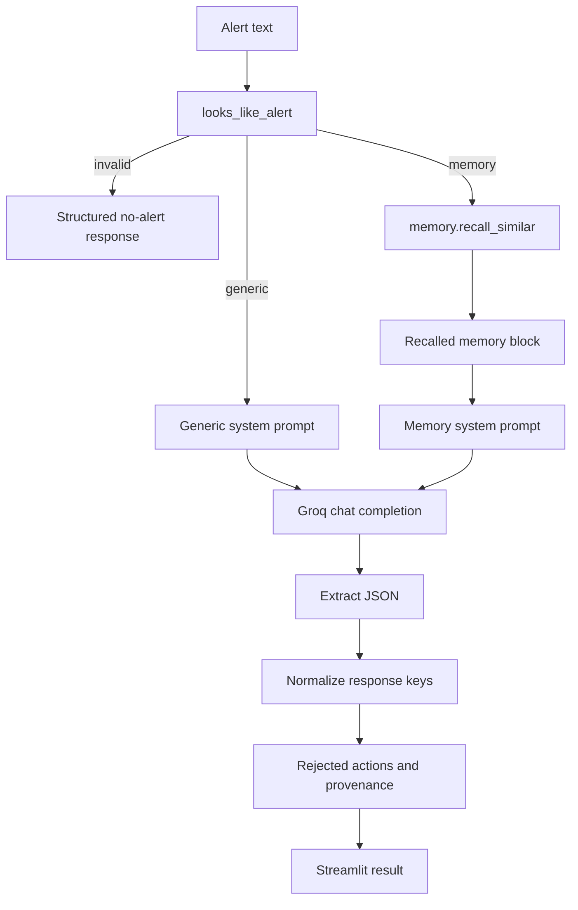

# AI Agent Architecture

`agent.triage(alert_text, use_memory)` is the application decision boundary.

## Prompt modes

- No-memory mode receives the alert and is instructed to leave evidence empty.
- Memory mode receives recalled memory and the alert. Its rules require historical citations, relevant deprecated-runbook warnings, failed-fix warnings, worked fixes first, and a `memory_influence` explanation.

## Deterministic safeguards

- Minimum alert shape check before model calls.
- Two model attempts per configured model in `_ask`.
- JSON extraction that removes `<think>` blocks and parses the outer object.
- `_normalize` converts malformed or missing fields into stable UI-compatible values.
- Sentence and token heuristics parse action outcomes from recalled prose.
- `demote_conflicting_fixes` removes recommendations that closely match rejected historical remediations.

## Response contract

The stable fields are `hypothesis`, `recommended_fixes`, `evidence`, `warnings`, `rejected_by_memory`, and `memory_influence`. Memory mode additionally supplies `recalled_memories`, `display_memories`, `display_evidence`, and `action_provenance`.

## Concurrency boundary

The generic Groq-only call runs in a worker thread while the memory-assisted Hindsight path remains on the main Streamlit thread. This follows the current client behavior and is part of the runtime contract.
