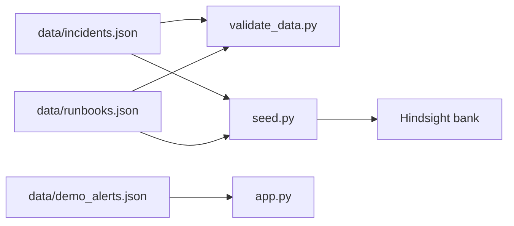
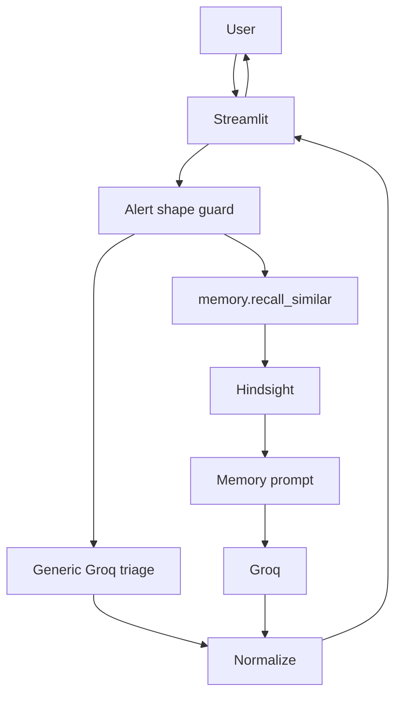
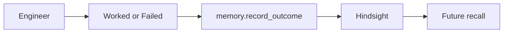

# Data Flow

## Seed flow

```mermaid
flowchart LR
    Incidents[data/incidents.json] --> Validate[validate_data.py]
    Runbooks[data/runbooks.json] --> Validate
    Incidents --> Seed[seed.py]
    Runbooks --> Seed
    Seed --> Hindsight[Hindsight bank]
    Demo[data/demo_alerts.json] --> App[app.py]
```

## Triage flow

```mermaid
flowchart TD
    User --> App[Streamlit]
    App --> Guard[Alert shape guard]
    Guard --> Baseline[Generic Groq triage]
    Guard --> Recall[memory.recall_similar]
    Recall --> Hindsight[Hindsight]
    Hindsight --> Prompt[Memory prompt]
    Prompt --> Groq[Groq]
    Baseline --> Normalize[Normalize]
    Groq --> Normalize
    Normalize --> App
    App --> User
```

## Feedback flow

```mermaid
flowchart LR
    Engineer --> Button[Worked or Failed]
    Button --> Record[memory.record_outcome]
    Record --> Hindsight
    Hindsight --> Future[Future recall]
```

The source dataset is synthetic. Demo alerts are loaded locally and are not automatically retained as incidents.
