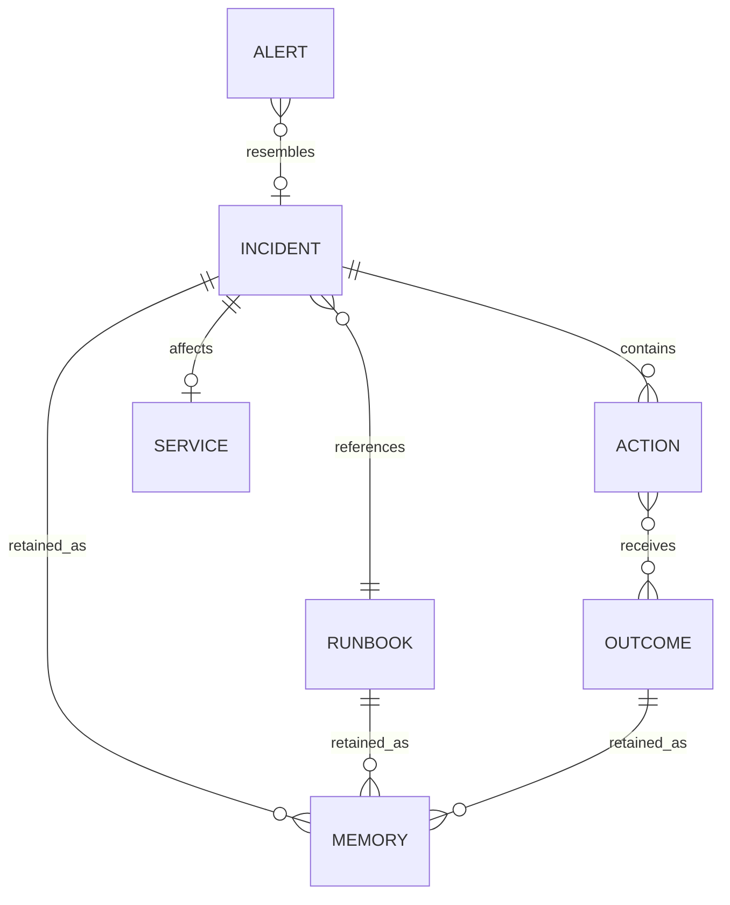

# Data Model

DejaOps uses local JSON as the source dataset and Hindsight as the persistent memory store. There is no local relational database or local HTTP API.

## Incident

Source: `data/incidents.json`.

| Field | Meaning |
|---|---|
| `id` | Stable incident identifier such as `INC-001` |
| `date` | Historical incident timestamp |
| `service` | Affected service or infrastructure component |
| `severity` | `SEV1`, `SEV2`, or `SEV3` in the current dataset |
| `alert` | Alert symptom text |
| `logs` | Synthetic log evidence |
| `root_cause` | Historical cause |
| `actions` | Array of attempted remediations |
| `resolution_minutes` | Historical resolution duration |
| `runbook` | Referenced runbook ID |
| `postmortem` | Historical narrative |

## Action

An incident action has `step` and `result`. Current source values are `worked` and `failed`. `memory.incident_text` formats each action into retained prose.

## Runbook

Source: `data/runbooks.json`. Fields include `id`, `title`, `status`, `steps`, `effective_from`, optional `deprecated_on`, optional `replaced_by`, optional `reason`, and `applies_to`. Deprecated runbooks retain the replacement relationship and are available as historical context.

## Alert

An alert is the user-provided text submitted to `agent.triage` or a record in `data/demo_alerts.json`. Demo alerts have an `id` and `alert` field. A new alert is not automatically persisted as an Incident record.

## Memory

Hindsight stores formatted incident postmortems, runbooks, engineer outcome feedback, and taught postmortems. `memory.recall_similar` returns text plus type and optional Hindsight metadata such as ID and context. `brain_graph.py` fetches stored memories for visualization.

## Agent response

The normalized response includes `hypothesis`, `recommended_fixes`, `evidence`, `warnings`, `rejected_by_memory`, and `memory_influence`. Memory mode adds `recalled_memories`, `display_memories`, `display_evidence`, and `action_provenance`.

## Provenance

Provenance is a derived record connecting a candidate fix to a recalled historical action. It carries the candidate, historical action, outcome, incident ID, source, date, historical result, and memory text when a local token-based match is found.
