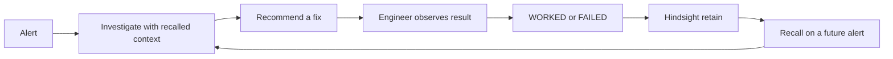

# Feedback Loop

Every incident is an opportunity to create operational memory. DejaOps connects an alert, its investigation, the selected remediation, and the observed result so later triage can reuse that experience.

## Current lifecycle

1. Historical incidents and runbooks are loaded by `seed.py` into the configured Hindsight bank.
2. A new alert is checked by `agent.looks_like_alert`.
3. Memory mode performs two Hindsight recalls: one for the alert and one for applicable or deprecated runbooks.
4. `agent.py` gives the recalled text to the model with rules to cite evidence, avoid failed remediations, and explain memory influence.
5. The Streamlit UI renders the memory-assisted recommendation beside a generic baseline.
6. Each displayed memory-assisted fix can be marked **Worked** or **Failed**.
7. `memory.record_outcome` retains timestamped engineer feedback in the same bank.
8. Future recalls can include that feedback alongside incident and runbook memories.

## Outcome vocabulary

- `worked`: the historical action result in incident JSON or engineer feedback indicates success.
- `failed`: the historical action result or engineer feedback indicates failure.
- `mixed`: the Memory Graph derives this display status when stored text contains both success and failure signals.
- `deprecated`: the Memory Graph derives this status for runbook text containing a deprecated runbook marker.

The current incident dataset stores action results as `worked` or `failed`. Mixed and deprecated are visualization classifications, not additional incident JSON action values.

## How feedback changes reasoning

The memory system prompt instructs the model to put historically successful fixes first, warn about failed fixes, and avoid recommending a remediation that failed under similar conditions. `agent.py` also applies deterministic post-processing: it parses recalled prose for action outcomes, can populate rejected-by-memory records, and demotes recommendations that closely match rejected remediations.

## Provenance

Historical action provenance includes the candidate fix, recalled action text, outcome, incident ID, source label, date, historical result, and source memory text when the local parser can establish a match. Feedback memories without an incident ID are labeled `FEEDBACK` when surfaced as rejected action history; they are not assigned a fabricated incident ID.

## UI representation

The triage view shows recalled incident evidence, outcome text, warnings, memory-assisted recommendations, and a memory count. The Memory Graph can highlight nodes mapped from the latest triage evidence, show status colors, display clusters, and open nearest-neighbor relationships. The graph's clusters are a local lexical visualization over fetched memory text, not Hindsight's internal graph.
