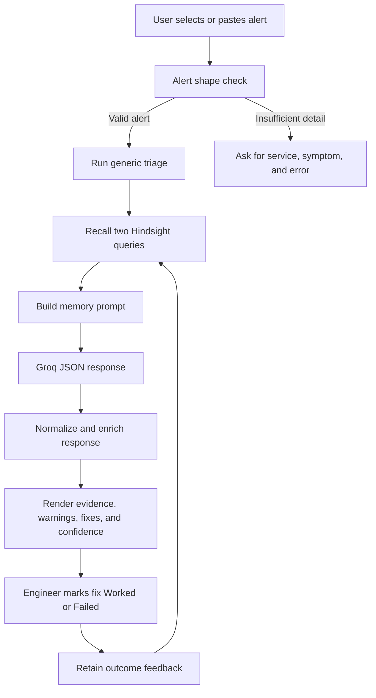

# Incident Response Workflow

## Step-by-step mapping

1. **Alert received:** `app.py` accepts pasted text or one of the records in `data/demo_alerts.json`.
2. **Incident identified:** `agent.looks_like_alert` requires at least 15 characters and three words. Non-alert input is rejected before a model call.
3. **Context collected:** The alert itself is passed to the model; historical context comes from Hindsight recall.
4. **Similar experience retrieved:** `memory.recall_similar` performs an alert query and a runbook applicability/deprecation query, deduplicating exact returned text.
5. **Runbook context identified:** Runbooks are retained with status, dates, replacement IDs, reasons, scope, and steps. The memory prompt tells the model to mention a deprecated runbook only when it applies.
6. **Agent reasons over evidence:** `agent._ask` calls the configured Groq model. Memory mode receives recalled text and the new alert; no-memory mode receives only the alert.
7. **Response normalized:** JSON extraction and `_normalize` ensure stable response keys for the UI. Provenance and rejected-action enrichment then run over recalled text.
8. **Action represented:** The UI renders recommended fixes with reasons and provides Worked/Failed controls for memory-assisted fixes.
9. **Outcome recorded:** `memory.record_outcome` retains the alert, fix text, verdict, and timestamp as outcome feedback.
10. **Experience reused:** A later recall can return the feedback, incident postmortem, or runbook memory and the model can adjust its recommendation.

## Human role

The current application recommends and records outcomes. It does not execute infrastructure changes. The feedback control represents the engineer's observed result after the operational decision.
