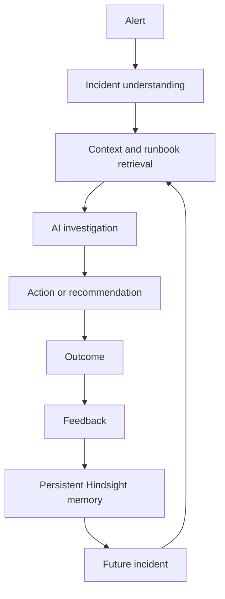

# LLM Context

## Project identity

- **Name:** DejaOps
- **Description:** Open-source AI Incident Response Assistant with persistent memory and feedback loops.
- **Problem:** On-call teams repeatedly investigate similar incidents and can lose the context of which remediations worked or failed.
- **Current domain:** Incident response for the synthetic Northwind Payments environment.
- **Differentiator:** A Worked/Failed outcome becomes Hindsight memory that can influence a future investigation.

## Core concept

## Repository map

| Path | Purpose | Inputs and outputs |
|---|---|---|
| `app.py` | Streamlit home triage view, demo alert loading, side-by-side rendering, feedback, graph navigation | Widget text and session state in; rendered UI and calls to `agent.py`, `memory.py`, and `brain_graph.py` out |
| `agent.py` | Alert validation, prompt construction, Groq calls, JSON extraction, normalization, action parsing, rejection, provenance | Alert text and recalled memory in; normalized response dictionary out |
| `memory.py` | Hindsight client and memory lifecycle boundary | Incidents, runbooks, feedback, postmortems, and alert queries in; retained or recalled memory out |
| `brain_graph.py` | Hindsight listing/recall fallback, local lexical clustering, D3 graph rendering | Stored memory and latest evidence in; graph payload and interactive component out |
| `seed.py` | Resumable loader for local incidents and runbooks | JSON source records in; Hindsight retain calls and progress file out |
| `validate_data.py` | Dataset checks | JSON source records in; validation summary out |
| `check_setup.py` | External service smoke checks | Environment credentials in; Hindsight/Groq status out |
| `merge_batches.py` | Combines `data/batches/*.json` into sorted incidents | Batch JSON in; `data/incidents.json` out |
| `data/` | Synthetic operational source data | Incidents, runbooks, demo alerts, and batches |
| `tests/` | Focused pytest tests | Fake clients and helper inputs in; behavior assertions out |

## Runtime flow

1. `app.py` loads demo alerts and accepts an alert.
2. `looks_like_alert` rejects short or non-alert input before model calls.
3. The UI starts a generic `triage(alert, False)` call and a memory `triage(alert, True)` call. The generic Groq-only path runs in a worker; Hindsight remains on the main Streamlit thread.
4. Memory mode calls `memory.recall_similar` twice and deduplicates exact text.
5. `agent._ask` sends either a generic prompt or a memory prompt plus the alert to the configured Groq model.
6. `_extract_json` and `_normalize` create stable response fields.
7. Memory mode attaches recalled memories, evidence, action provenance, rejected actions, and display fields.
8. `app.py` renders both results. A Worked/Failed click calls `memory.record_outcome`.
9. The brain button calls `brain_graph.render_brain_page`, which lists or broadly recalls memories, clusters them locally, and renders D3.

## Data and memory model

Incidents contain IDs, timestamps, service, severity, alert, logs, root cause, actions, resolution time, runbook ID, and postmortem. Runbooks contain IDs, titles, status, steps, scope, and lifecycle metadata. Memories are formatted incident, runbook, feedback, or taught-postmortem text retained in one configured bank.

`recall_similar` returns dictionaries with `type`, `text`, and optional `id` and `context`. Memory prompts require incident evidence IDs, failed-fix warnings, relevant deprecated-runbook warnings, and a concise `memory_influence` explanation. Feedback without an incident ID is labeled `FEEDBACK` when needed; the code does not invent an incident ID.

## Feedback loop

Historical actions are stored as `WORKED` or `FAILED`. Engineer feedback is retained with the current alert and fix text. During later triage, the model is instructed to prioritize worked fixes and reject failed remediations. Local token/sentence heuristics enrich provenance and can demote a recommendation matching a rejected historical action.

## UI and metrics

The home view shows a generic response, a Hindsight response, recalled evidence, warnings, vetted fixes, confidence, and outcome controls. The Memory Graph shows local similarity clusters and highlights latest recalled evidence. Current source metrics are 120 incidents, 20 runbooks, 10 demo alerts, 304 action records, 172 worked actions, 132 failed actions, and 2 deprecated runbooks.

## Configuration

Required environment variables are `HINDSIGHT_URL`, `HINDSIGHT_API_KEY`, and `GROQ_API_KEY`. `DEJAOPS_BANK` selects the Hindsight bank and defaults to `dev-test` in `memory.py` when absent. `.env.example` contains names only. Do not document or commit values.

## Extension guidance

- New incident types: add schema-compatible records under `data/` and seed them.
- New runbooks: add records and retain through `memory.retain_runbook`.
- New tools: add an explicit adapter and outcome/audit boundary before exposing controls.
- New agent behavior: update `agent.py` prompts and post-processing while preserving normalized keys.
- New memory behavior: extend `memory.py` and document the lifecycle.
- New metrics: derive source counts or add runtime instrumentation with scope and method.
- New UI: preserve Streamlit session-state contracts in `app.py`; use `brain_graph.py` for graph work.
- New domains: update data vocabulary, bank mission, and outcome signals.

## LLM quick start

1. Read this file.
2. Read [PROJECT_OVERVIEW.md](PROJECT_OVERVIEW.md).
3. Read [SYSTEM_ARCHITECTURE.md](SYSTEM_ARCHITECTURE.md).
4. Read [MEMORY_ARCHITECTURE.md](MEMORY_ARCHITECTURE.md).
5. Read [FEEDBACK_LOOP.md](FEEDBACK_LOOP.md).
6. Inspect `app.py`, `agent.py`, `memory.py`, `brain_graph.py`, and the relevant tests.
7. Preserve the existing architecture and response contracts unless explicitly asked to change them.
