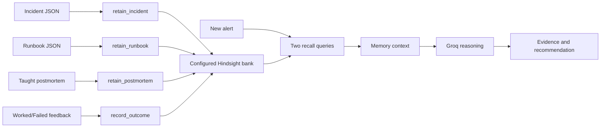

# Memory Architecture

## Lifecycle

## Stored memory types

- Incident postmortem: formatted incident fields, logs, root cause, actions, resolution, runbook, and postmortem.
- Runbook: title, status, lifecycle dates, replacement, reason, scope, and steps.
- Outcome feedback: timestamped alert/fix text with `WORKED` or `FAILED`.
- Taught postmortem: free-form engineer text retained with a timestamp.

## Retrieval

`recall_similar` queries the alert and a runbook applicability/deprecation question, requests a bounded token budget, and deduplicates exact result text. The recalled result preserves Hindsight type, text, ID, and context when available.

## Reflection and graph

`learned_summary` uses Hindsight `reflect` to summarize stored facts. `brain_graph.py` uses `list_memories` first and broad fallback recalls when needed, then builds a local token-overlap graph. This graph is a UI projection and not Hindsight's internal graph.

## Provenance

`agent.py` parses recalled memory sentences for action outcomes and links them to candidate fixes using token containment/similarity. Provenance is shown only when an incident ID can be established; feedback without one is represented as `FEEDBACK` rather than an invented ID.
