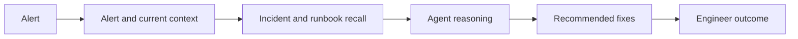
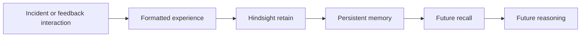
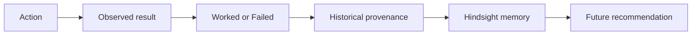
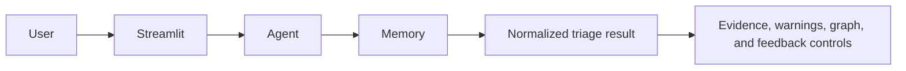

# Pipelines

## Incident pipeline

## Memory pipeline

## Feedback pipeline

## Data pipeline

`data/incidents.json` and `data/runbooks.json` are validated, then retained by `seed.py`. `data/demo_alerts.json` is read by `app.py` for selectable demonstrations. `merge_batches.py` can rebuild the incident source from `data/batches/`.

## UI pipeline

