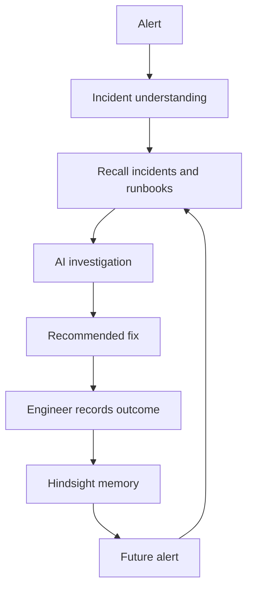

# DejaOps

DejaOps is an open-source AI Incident Response Assistant for on-call engineering. It combines a Streamlit triage interface, Groq-powered reasoning, Hindsight persistent memory, synthetic incident/runbook data, and explicit Worked/Failed feedback.

## The problem

Incident response teams repeatedly investigate familiar symptoms. DejaOps makes prior incident experience available at triage time so recommendations can account for actions that worked, actions that failed, and runbooks that have been replaced.

## Current implementation

The current domain is incident response for the synthetic Northwind Payments environment. A user pastes an alert or selects one of ten demo alerts. The application runs a generic comparison and a memory-assisted triage, then shows hypotheses, fixes, historical evidence, warnings, and memory influence. Engineers can record whether a displayed fix worked or failed. The Memory Graph visualizes stored Hindsight memories and highlights evidence used by the latest triage.

## Core differentiator

The feedback loop turns an incident interaction into reusable operational memory:

## Stack

| Layer | Implementation |
|---|---|
| UI | Streamlit in `app.py` |
| Agent | Python orchestration and output normalization in `agent.py` |
| Model provider | Groq chat completion; model list is configured in `agent.py` |
| Persistent memory | Hindsight bank through `hindsight-client` in `memory.py` |
| Local source data | JSON incidents, runbooks, and demo alerts under `data/` |
| Graph visualization | Python lexical clustering plus D3 in `brain_graph.py` |

## Dataset

Northwind Payments is fictional. The repository includes 120 incidents, 20 runbooks, 10 demo alerts, and 304 historical action records. The data covers recurring operational patterns involving services such as payments-api, checkout-service, Redis, Postgres, Kafka, Kubernetes, DNS, TLS, and the PayFlow gateway where represented by the source files.

## Open-source extension model

The code is organized so a developer can replace the JSON seed data, add domain-specific tools or runbooks, define outcome signals, and reuse the memory and feedback pattern for other operational workflows. SRE, SOC, IT operations, support, and infrastructure troubleshooting are potential adaptations; they are not additional integrations in the current implementation.

See [DOCUMENTATION_INDEX.md](DOCUMENTATION_INDEX.md) for the complete guide.
