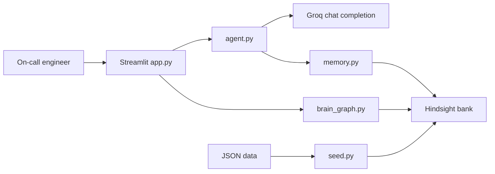
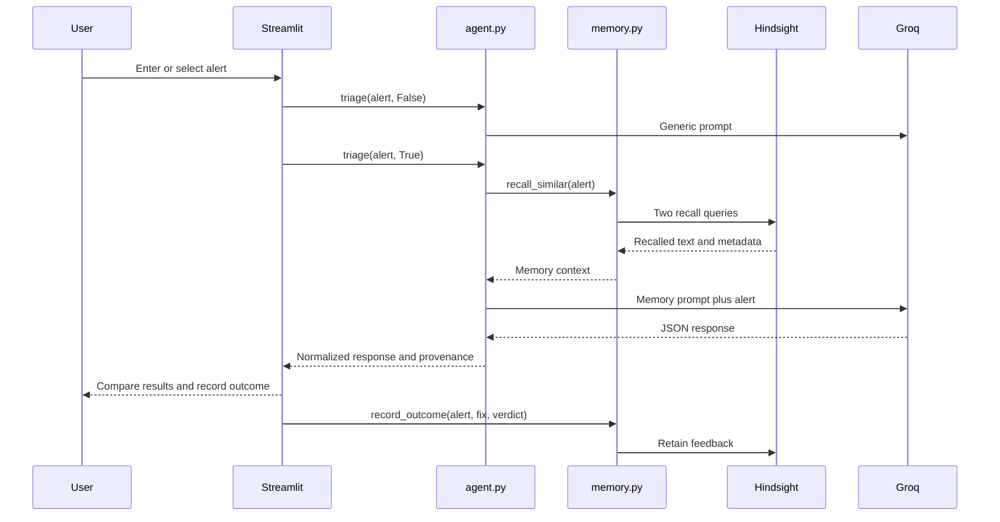
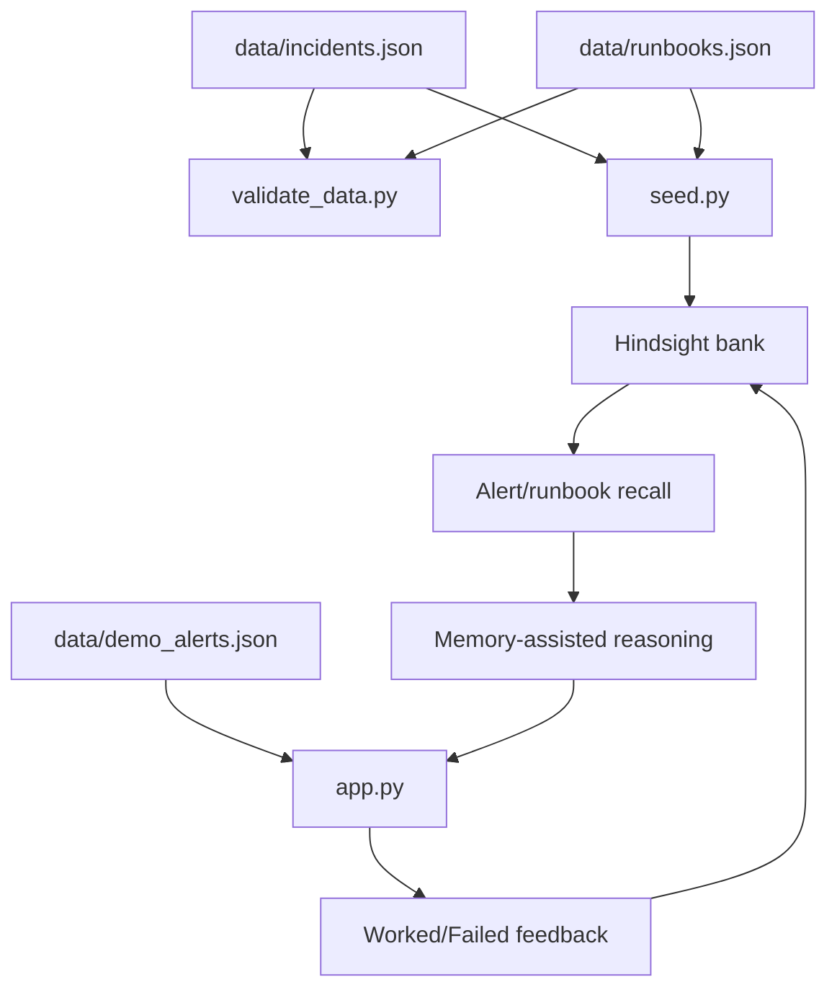

# System Architecture

## System overview

## Runtime architecture

## Component responsibilities

- `app.py`: Streamlit state, alert input, triage comparison, feedback controls, and graph navigation.
- `agent.py`: alert guard, prompts, Groq call retries, JSON normalization, rejection detection, and provenance enrichment.
- `memory.py`: Hindsight client, bank initialization, incident/runbook retention, recall, reflection, feedback, and taught postmortem retention.
- `brain_graph.py`: memory listing/recall fallback, lexical similarity, clusters, statuses, and D3 rendering.
- `seed.py`: resumable retention of local incidents and runbooks.
- `validate_data.py`: source-data structure and relationship validation.

## Data architecture

## Agent and feedback architecture

The agent is request-driven rather than a background worker. It recommends and records outcomes; it does not execute infrastructure changes. The feedback loop is documented in [FEEDBACK_LOOP.md](FEEDBACK_LOOP.md), and the detailed agent path is in [AI_AGENT_ARCHITECTURE.md](AI_AGENT_ARCHITECTURE.md).

## UI and metrics architecture

The home view renders the two triage paths and feedback. The Memory Graph reads Hindsight separately and performs local lexical clustering. Current dataset metrics are derived from JSON; no production telemetry pipeline is present. See [UI_ARCHITECTURE.md](UI_ARCHITECTURE.md) and [METRICS.md](METRICS.md).
