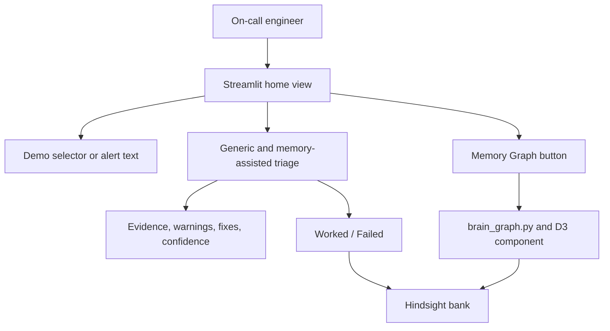

# UI Architecture

DejaOps is a Streamlit application in `app.py` with a home triage view and a memory graph view.

## Home triage view

- Header shows the DejaOps identity and configured memory bank ID.
- Demo selection loads alerts from `data/demo_alerts.json`.
- Alert input accepts pasted operational text.
- Triage runs a generic baseline and a memory-assisted response side by side.
- The result area shows recalled incident count, warnings, vetted fixes, confidence, hypotheses, evidence, and memory-assisted fix controls.
- Worked/Failed controls call `record_outcome` and show a saved indicator.
- The page includes timing labels for the two triage paths.

## Memory Graph view

The brain button switches Streamlit session state to the graph page. `brain_graph.render_brain_page` obtains stored memories, clusters them locally using token overlap and shared incident/runbook identifiers, and renders an interactive D3 component. Nodes expose memory text, type, status, and nearest relationships. Evidence from the latest memory-assisted triage is highlighted when it maps to graph nodes.

## State and external boundaries

Session state stores the current alert, triage responses, timing, saved feedback, selected page, and cached graph payload. Hindsight calls remain on the Streamlit thread because the client uses async networking internally; only the generic Groq baseline is submitted to a worker thread in the current triage flow.

The UI does not provide a local REST API, authentication flow, infrastructure command executor, or separate persistence layer.
